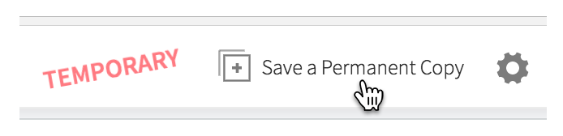
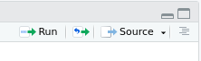

class: left

```{r setup, include=FALSE}
options(htmltools.dir.version = FALSE)
```

# R for Data Science

### Everyone please do the following now if you haven't already:

1. Sign up for a free account at [rstudio.cloud](https://rstudio.cloud/)

2. Visit https://tinyurl/????? to join our shared workspace

3. Open the r-for-data-science project

4. Save a Permanent Copy of the project



---
class: left

## Your turn

#### Open the `r-for-data-science` project and open the following file:

.exercise[eat-cake-first.R]



Source the file by clicking the "Source" button at the top right of the editor pane.

> Note: In RStudio, "Run" executes the current line or selection, while "Source" executes the contents of the whole file.

--

Try changing one or both of the countries to any of the following: 

```
Australia, Austria, Belgium, Canada, Czech Republic, Denmark, Estonia,
Finland, France, Germany, Greece, Hungary, Iceland, Ireland, Israel,
Italy, Luxembourg, Netherlands, Norway, Poland, Slovakia, Slovenia,
Spain, Sweden, Switzerland, United Kingdom, United States
```

---
class: left

# Welcome


---
class: left

# Welcome

Workshop goals

* Introduce R, RStudio, and the Tidyverse

* Learn enough to begin using R for real work

* Overview of what is available

* Have fun

---
class: left

# Welcome

## Introductions

* Your name

* Why are you here?

* One other thing about you

---
class:left

# Welcome

Outline

* Introduction to RStudio Cloud

* Visualizing data with ggplot2

* Data wrangling with dplyr and tidyr

* [lunch?]

* Exploratory data analysis

* R programming

* RMarkdown

* Shiny

---
class:left

# Logistics

* Breaks

* Lunch

* Rest rooms

---
class: center

[https://r4ds.had.co.nz/](https://r4ds.had.co.nz/)


---
class: middle, center


<br/>
<br/>
<br/>
<br/>
<p style="font-size: x-small">
Image source: <a href="http://r4ds.had.co.nz/">R for Data Science</a> by Hadley Wickham & Garrett Grolemund.
</p>

---
class: left

# R, RStudio, & RStudio Cloud

### .highlight[R] is a language

### .highlight[RStudio] is an IDE (also a company)

### .highlight[RStudio Cloud] is RStudio (the IDE) hosted by RStudio (the company)

---
class: left

# What is R?

From the official R website:

> R is a .highlight[free software environment] for .highlight[statistical computing] and .highlight[graphics]. It compiles and runs on a wide variety of .highlight[UNIX] platforms, .highlight[Windows] and .highlight[MacOS].

--

- general purpose programming language

--

- large standard library with strong support for
 + data wrangling
 + data analysis & statistical computations
 + plotting and data visualization

--

- large number of contributed libraries

--

- written in R, C++, and Fortran

--

- conceived in 1992 as an open source replacement for the S language. Initial release in 1995, version 1.0 in 2000, version 3.5 in 2018

---
class: left

# RStudio IDE

- Free and open source integerated development environment for R

--

- RStudio Desktop (Windows, MacOS, Linux)

- RStudio Server (via browser)

--

- RStudio Cloud (hosted by RStudio, the company)

---
class: left

# RStudio (the company)

- Founded by J.J. Allaire (creator of Cold Fusion)

--

- Chief Scientist is Hadley Wickham

--

- RStudio has contributed to many packages, including

  - Tidyverse - R packages for data science
  - Shiny - web framework for R
  - RMarkdown - combine R code with markdown
  - knitr - generate dynamic reports
  - packrat - dependency management
  - devtools - package development tools

--

- rstudio::conf January 27-30, 2020, San Francisco

  Session videos for past conferences are available at rstudio.com

---
class: middle, center

# Your turn

### RStudio Cloud
### RMarkdown notebook

.exercise[your-turn/00-introduction.Rmd]

```{r echo=FALSE}
library(countdown)

countdown(minutes = 5)
```


