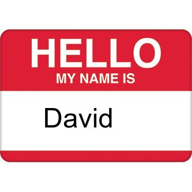
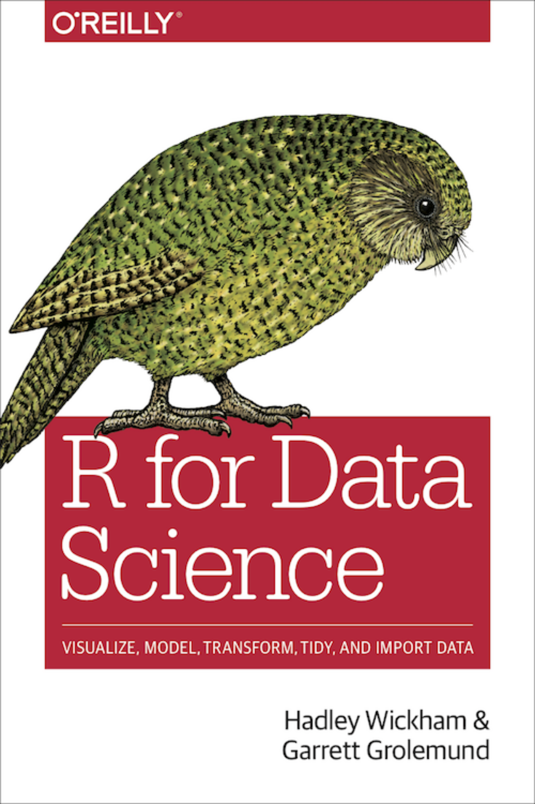

class: left

```{r setup, include=FALSE}
options(htmltools.dir.version = FALSE)
```

# Welcome

Workshop goals

* Introduce R, RStudio, and the Tidyverse

* Learn enough to begin using R for real work

* Overview of what is available

---
class: left

# RStudio Cloud

Everyone should have an RStudio Cloud account.

Everyone should be a member of the shared RStudio Cloud workspace for the workshop.

--
### Your turn

Open the `r-for-data-science` project, open the following file, and follow my instructions:

.exercise[demos/data-visualization-with-ggplot2/eat-cake-first.R]

Credit: [Mine Çetinkaya-Rundel](https://www2.stat.duke.edu/~mc301/)
---
class: left

# Welcome



---
class:left

# Welcome

My goals for me

* Practice run for July 17 [KCDC](https://www.kcdc.info/) workshop
  - Materials
  - Demos
  - Exercises
  - RStudio Cloud

* Can someone please time each section?

* Feedback so I can improve the workshop

* Have fun

---
class: left

# Welcome

## Introductions

* Your name

* Why are you here?

* One other thing about you

---
class:left

# Welcome

Outline

* Introduction to RStudio Cloud

* Visualizing data with ggplot2

* Data wrangling with dplyr and tidyr

* [lunch?]

* Exploratory data analysis

* R programming

* RMarkdown

* Shiny

---
class:left

# Logistics

* Thanks to Scott Burklund / Preverity for sponsoring coffee

* Breaks

* Lunch (on your own)

* Rest rooms

---
class: center

[https://r4ds.had.co.nz/](https://r4ds.had.co.nz/)



---
class: middle, center


<br/>
<br/>
<br/>
<br/>
<p style="font-size: x-small">
Image source: <a href="http://r4ds.had.co.nz/">R for Data Science</a> by Hadley Wickham & Garrett Grolemund.
</p>

---
class: middle, center

# Your turn

### RStudio Cloud
### RMarkdown notebook

.exercise[exercises/00-introduction.Rmd]
