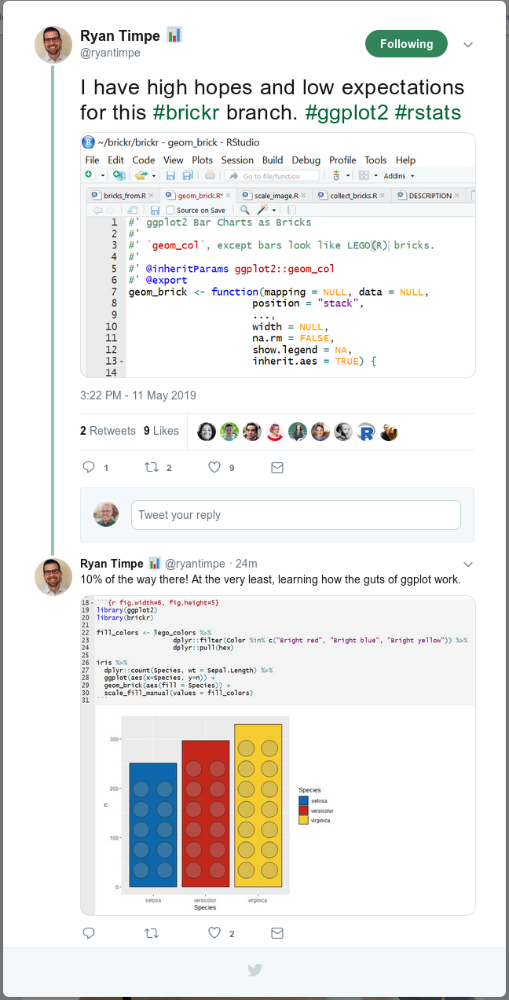

class:left

```{r setup, include=FALSE}
options(htmltools.dir.version = FALSE)
```

## Data Visualization with ggplot2

### Outline

- Overview of ggplot2

- Prerequisites
  - Tidyverse
  - Data frames

- Grammar of Graphics

- Exploratory vs Expository Plots

---
class: center

# Data science workflow


<br/>
<br/>
<br/>
<br/>
<p style="font-size: x-small">
Image source: <a href="http://r4ds.had.co.nz/">R for Data Science</a> by Hadley Wickham & Garrett Grolemund.
</p>

---
class: center

# Data science workflow


<br/>
<br/>
<br/>
<br/>
<p style="font-size: x-small">
Image source: <a href="http://r4ds.had.co.nz/">R for Data Science</a> by Hadley Wickham & Garrett Grolemund.
</p>

---
class: left

# ggplot2

From the official ggplot2 website:

> [ggplot2](http://ggplot2.tidyverse.org/) is a system for declaratively creating graphics, based on [**The Grammar of Graphics**](http://amzn.to/2ef1eWp). You provide the .red[data], tell ggplot2 how to map variables to .red[aesthetics], what .red[graphical primitives] to use, and it takes care of the details.

--

- R package

--

- Developed by Hadley Wickham (PhD, Iowa State, 2008)

--

- Now part of the tidyverse

--

- Other R graphics systems: base, lattice, grid

--

- Extensible

--

- Worth the learning curve

---
class: left

# Prerequisites

### Tidyverse

* Opinionated collection of R packages
* Share underlying design philosophy, grammar, and data structures

### Data frames

* Rectangular data structure
* Columns represent variables
* Rows represent observations
* Tidyverse data frames are called "tibbles"

**Tidyverse packages work with tidy tibbles**

--
.demo[Demo]

---
class: left

# Grammar of Graphics

--

- .highlight[Data] (data frame in tidy format)

--

- Layers of .highlight[geom]etric objects and .highlight[stat]istical transformations

--

- .highlight[Scale]s that map data values to (and from) .highlight[aes]thetic space values (location, color, size, etc.)

--

- .highlight[Coord]inate system (Cartesion, map projections, polar)

--

- .highlight[Facet]ing (breaking data into subsets)

--

- .highlight[Theme]s

---
class: left

# Facets are subplots

For example,

```{r ggplot2, message=TRUE, warning=TRUE, include=FALSE}
library(ggplot2)
```

```{r facets, fig.height=5, fig.width=9}
ggplot(data = mpg, mapping = aes(displ, hwy)) +
  geom_point() +
  facet_wrap(vars(class), nrow = 2)
```

---
class: left

# Grammar of Graphics

We will focus on 3 main elements of the grammar:

* .highlight[Data] (data frame in tidy format)

* Layers of .highlight[geom]etric objects

* Mappings of data values to visual properties (.highlight[aes]thetics) of geoms

---
class: left

# ggplot2 template

```{r, eval=FALSE}
ggplot(data = <DATA>) + 
  <GEOM_FUNCTION>(mapping = aes(<MAPPINGS>)) +
  <GEOM_FUNCTION>(mapping = aes(<MAPPINGS>)) +
  ...
```

--

If the geoms use the same aesthetics:

```{r, eval=FALSE}
ggplot(data = <DATA>, mapping = aes(<MAPPINGS>)) + 
  <GEOM_FUNCTION>() +
  <GEOM_FUNCTION>() +
  ...
```

--

.demo[Demo]

---
class: left

# Full ggplot2 template

```{r, eval=FALSE}
ggplot(data = <DATA>) + 
  <GEOM_FUNCTION>(
     mapping = aes(<MAPPINGS>),
     stat = <STAT>, 
     position = <POSITION>
  ) +
  <COORDINATE_FUNCTION> +
  <FACET_FUNCTION> +
  <SCALE_FUNCTION> +
  <THEME_FUNCTION>
```

Required elements: &lt;DATA&gt;, &lt;GEOM_FUNCTION&gt;, &lt;MAPPINGS&gt;

Other elements have sensible defaults.

---
class: left

# Some named graphs and their geoms

Name | Geom
---- | ----
Scatterplot | geom_point()
Linegraph | geom_line()
Histogram | geom_histogram()
Boxplot | geom_boxplot()
Barplot | geom_barplot()

--

.demo[Demo]

---
class: center

ggplot2 is extensible



---
class: left

### You can create almost any 2-dimensional plot with ggplot2

```{r ggplot2-logo, echo=FALSE, fig.width=9}
source("../demos/data-visualization-with-ggplot2/ggplot2-hex-logo.R")

ggplot2_hex_logo
```

Source code is in demos/data-visualization-with-ggplot2/ggplot2-hex-logo.R

---
class: middle, center

# Your turn

### Data visualization with ggplot2

.exercise[your-turn/01-data-visualization-with-ggplot2.Rmd]

```{r echo=FALSE}
library(countdown)
countdown(minutes = 15, update_every = 15, warn_when = 120, top = 0, play_sound = TRUE)
```
