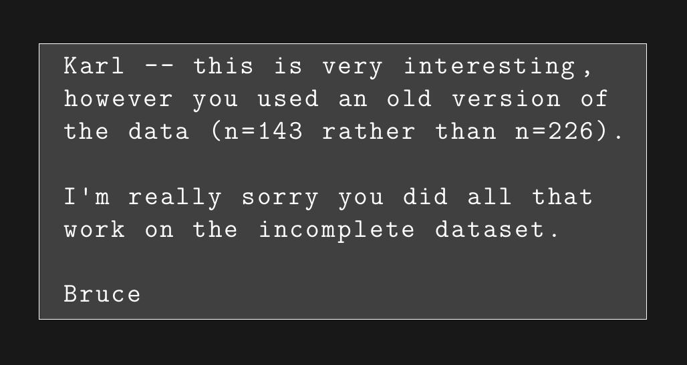

class:left

```{r setup, include=FALSE}
options(htmltools.dir.version = FALSE)
```

## R Markdown

### Outline

- Overview

- R Markdown basics

- Code chunks

- YAML header

---
class: center

# Data science workflow


<br/>
<br/>
<br/>
<br/>
<p style="font-size: x-small">
Image source: <a href="http://r4ds.had.co.nz/">R for Data Science</a> by Hadley Wickham & Garrett Grolemund.
</p>

---
class: center

# Data science workflow


<br/>
<br/>
<br/>
<br/>
<p style="font-size: x-small">
Image source: <a href="http://r4ds.had.co.nz/">R for Data Science</a> by Hadley Wickham & Garrett Grolemund.
</p>

---
class: left

# R Markdown Overview

Use cases:

* Communicating with decision makers

* Collaborating with other data scientists

* Environment for *doing* data science

---
class: left

## Reproducible research



---
class: left

# R Markdown basics

Many output formats are available. See [Formats](https://rmarkdown.rstudio.com/formats.html) at rmarkdown.rstudio.com.


---
class: left

# R Markdown basics

## Plain text file with extension *.Rmd*

## Three types of content

1. Optional **YAML header**

2. **Chunks** of R code

3. Text with **Markdown** formatting

## "Knitting" with **knitr**


---
class: left

# R Markdown basics

## Markdown Quick Reference in RStudio Help

--
.demo[Demo]

---
class: left

## Code chunks

**knitr** provides almost 60 options for code chunks.

RStudio provides help for the most common ones.

Inline code too.

--

.demo[Demo]

Couldn't figure out how to display markdown in markdown. 🙂

---
class: left

## YAML header

* Used for "whole document" settings.

* Can use it to parameterize a document.

```{---
title: "Parameters example"
output: html_document
params:
  year: 2018
---
```
  - Knit with parameters or
```{r eval=FALSE}
    rmarkdown::render("my-report.Rmd", params = list(year = 2019))
```

In the document, use parameters like this in a code chunk:

```{r eval=FALSE}
filter(year == params$year)
```

* Much more

---
class: left

# R Markdown resources

* Extensive documentation and examples at [rmarkdown.rstudio.com](https://rmarkdown.rstudio.com/)

* [R Markdown: The Definitive Guide](https://bookdown.org/yihui/rmarkdown/) by Yihui Xie, J. J. Allaire, Garrett Grolemund

---
class: center

# Your turn

### R Markdown

.left[
* Create a new R Markdown document with *File > New File > R Markdown…*

* Knit it by clicking the appropriate button.

* Knit it by using the keyboard short cut. (Look on the File menu.)

* Using the R Markdown quick reference:

  * Add a horizontal rule.

  * Add a blockquote.
  
* Add a plot.
]

```{r echo=FALSE}
library(countdown)
countdown(minutes = 10, update_every = 15, warn_when = 120, top = 0, play_sound = TRUE)
```
