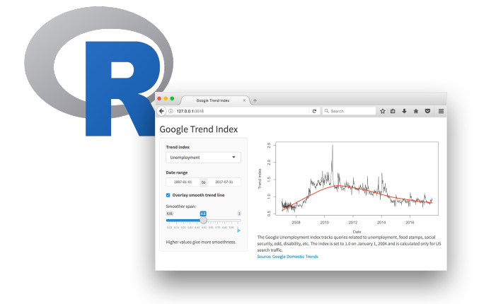
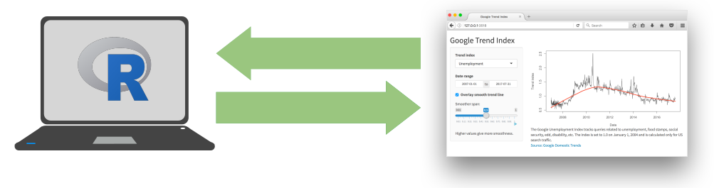
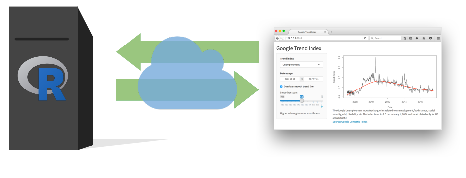

class:left

```{r setup, include=FALSE}
options(htmltools.dir.version = FALSE)
```

## Shiny

### Outline

- Overview

- Shiny app structure

- Reactivity

- File structure

- Deployment

---
class: center

# Data science workflow


<br/>
<br/>
<br/>
<br/>
<p style="font-size: x-small">
Image source: <a href="http://r4ds.had.co.nz/">R for Data Science</a> by Hadley Wickham & Garrett Grolemund.
</p>

---
class: center

# Data science workflow


<br/>
<br/>
<br/>
<br/>
<p style="font-size: x-small">
Image source: <a href="http://r4ds.had.co.nz/">R for Data Science</a> by Hadley Wickham & Garrett Grolemund.
</p>

---
class: left

# Shiny

## Overview

- Web apps written completely in R

- Shiny generates a web UI consisting of HTML, CSS, & JavaScript

- The web server executes R code

- The UI interacts with the R server using websockets

- You only have to write R code

---
class: center



A Shiny app consists of a web page served by an R program.

<br/>
<br/>
<br/>
<p style="font-size: x-small">
Image credit: Mine Çetinkaya-Rundel / RStudio
</p>

---
class: center



During development and when running locally, the R program is running on your computer.

<br/>
<br/>
<br/>
<br/>
<br/>
<p style="font-size: x-small">
Image credit: Mine Çetinkaya-Rundel / RStudio
</p>

---
class: center



When the Shiny app is deployed in production, a web server runs the R program that serves the app.

The R program processes data and generates the UI (HTML, CSS, JavaScript).

The UI (HTML, CSS, JavaScript) runs in the user's web browser.

<br/>
<br/>
<br/>
<p style="font-size: x-small">
Image credit: Mine Çetinkaya-Rundel / RStudio
</p>

---
class: left

# Shiny

## Shiny app structure

```{r eval=FALSE}
library(shiny)

ui <- fluidPage()

server <- function(input, output) {}

shinyApp(ui = ui, server = server)
```

--
.demo[Demo]

---
class: left

# Shiny

## Reactivity

Shiny has three kinds of objects for reactive programming.


The simplest structure of a reactive program involves just a source and an endpoint:


---
class: left

# Shiny

## Reactivity example

```{r, eval=FALSE}
server <- function(input, output) {
  output$distPlot <- renderPlot({
    hist(rnorm(input$obs))
  })
}
```


See it in action: https://gallery.shinyapps.io/01_hello/

---
class: left

# Shiny

## Household Income example

Our "eat cake first" demo turned into a Shiny app!

--
.demo[Demo]

---
class: left

# Shiny

## Deploying your app

* [Shinyapps.io](https://shinyapps.io) - hosting service from RStudio ($, includes a free tier)

* [Shiny server](https://www.rstudio.com/products/shiny/download-server/) - open source, deploy to your own server or Docker container

* [RStudio Connect](https://www.rstudio.com/products/connect/) - RStudio publishing platform for Shiny apps, RMarkdown reports, Plumber API's, dashboards, and more ($$$)

---
class: middle, center

# Your turn

### Shiny

.exercise[Create a shiny web app!]
